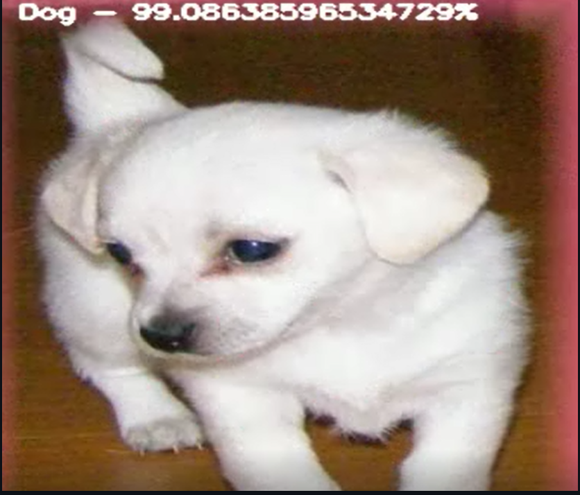

---

## **Task 1: MNIST Classification**  
**Objective:** Train a neural network to classify handwritten digits from the MNIST dataset.  

---

## **Task 2: CIFAR-10 Classification**  
**Objective:** Train a CNN to classify images from the CIFAR-10 dataset into 10 categories.  

### **Subtasks:**  
1. **Load and preprocess the dataset**  
   - Use `torchvision.datasets.CIFAR10`
   - Normalize the images and apply data augmentation (rotation, flipping, etc.).  

2. **Build a Convolutional Neural Network (CNN)**  
   - Use Conv2D, MaxPooling, and BatchNorm layers.  
   - Experiment with different architectures (e.g., deeper networks with ResNet-like blocks).  

3. **Train the model**  
   - Use `Adam` optimizer and an appropriate loss function.  
   - Implement learning rate scheduling.  

4. **Evaluate the model**  
   - Plot accuracy/loss graphs.  
   - Display misclassified images with predicted vs. true labels.  

5. **(Bonus) Train on CIFAR-100**  
   - Modify the model for CIFAR-100 classification.  
   - Compare performance with CIFAR-10.  

---

# **Task 3: Cats vs Dogs Classification**

## **Objective**  
Train a Convolutional Neural Network (CNN) to classify images of cats and dogs from the given dataset.  

## **Dataset**  
[Microsoft Cats vs Dogs Dataset](https://www.kaggle.com/datasets/shaunthesheep/microsoft-catsvsdogs-dataset)  

show in ur docs  some sample images like this

## **Subtasks**  

### **1. Load and Preprocess the Dataset**  
- Download and extract the dataset from Kaggle.  
- Resize all images to a fixed size (e.g., 128x128 or 224x224).  
- Normalize pixel values to the range [0,1].  
- Split into training and validation sets.  

###  **Data Augmentation**  
- Apply transformations such as flipping, rotation, and zooming.  
- Compare performance with and without augmentation. 

### **2. Build a CNN Model**  
- Use `Conv2D`, `MaxPooling2D`, `BatchNormalization`, and `Dense` layers.  
- Experiment with different architectures (e.g., deeper networks like ResNet or MobileNet).  
- Use dropout to reduce overfitting.  

### **3. Train the Model**  
- Use an appropriate loss function (`binary_crossentropy`).  
- Train using the Adam optimizer.  
- Implement early stopping and learning rate scheduling.  

### **4. Evaluate the Model**  
- Plot training and validation accuracy/loss.  
- Display some misclassified images with predicted vs. true labels.  

 

### Additional Instructions  
- The datasets can be found within the subtasks itself
- You are allowed as well as recommended to use AI tools for writing code.
- Make sure to understand what the code does and explore alternate approaches that could have been taken.
- Keep your notebook clean and structured by using markdown sections
- you have to give small write up in the [readme](README.md)