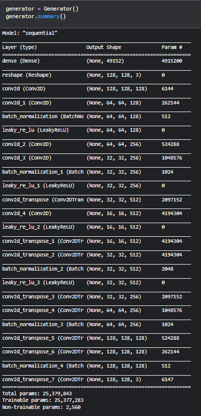
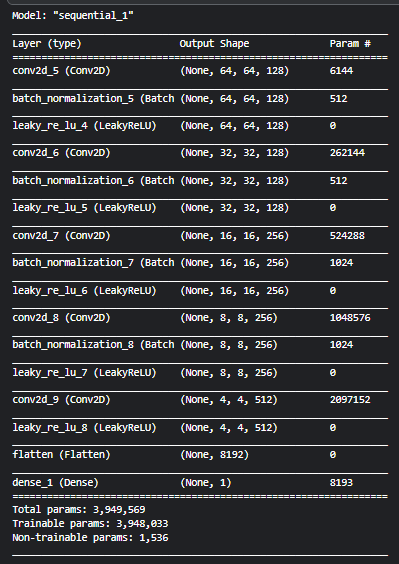

# Task 5 ( final task)
 You made it till here great job, most people would have given up midway, now for the final test let us make you do some work

 # A

Using GANS generate hand written digits, you can make use of the mnist dataset.

make sure your notebook is well documented, so you can use later to publish on kaggle, or write a blog or maybe use the pipeline for other dataset

references 
https://github.com/sssingh/mnist-digit-generation-gan
https://www.kaggle.com/code/zhoulingyan0228/generating-mnist-gan
https://www.kaggle.com/code/sinclairg/pytorch-gan-generating-mnist-digits

# B
complete the notebook 
lets do something more interesting and more to the level of our project, that might alone with worth mentioning 

## read the notebook carefuly

compelete the notebook  to match generator and discriminator here

## NOTE
- do note that gans are not best, there are many variations like CycleGANs, WGANS, that use the same funda, 

- dont worry if the result dont look great, you are just getting started